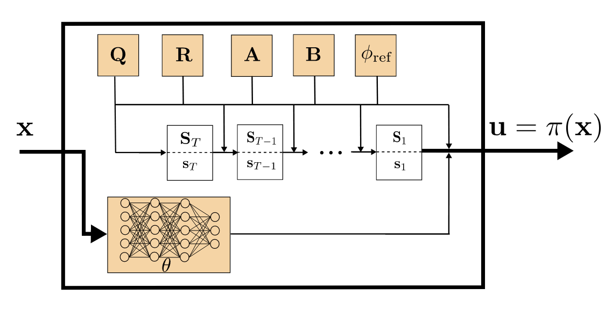

# koopman_policy
An Implementation of Koopman estimation, control and policy learning for paper

*Yin, H., Welle, M. C., and Kragic, D. Embedding Koopman Optimal Control in Robot Policy Learning. 2022 IEEE/RSJ International Conference on Intelligent Robots and Systems (IROS). Kyoto, Japan.*

  

# Dependencies
pytorch (tested on 1.12.1)

numpy

matplotlib

**For policy learning and gym environments**

[pybullet](https://github.com/bulletphysics/bullet3)

[garage](https://github.com/rlworkgroup/garage)

[DEDO](https://github.com/contactrika/dedo)

Weights & Biases
